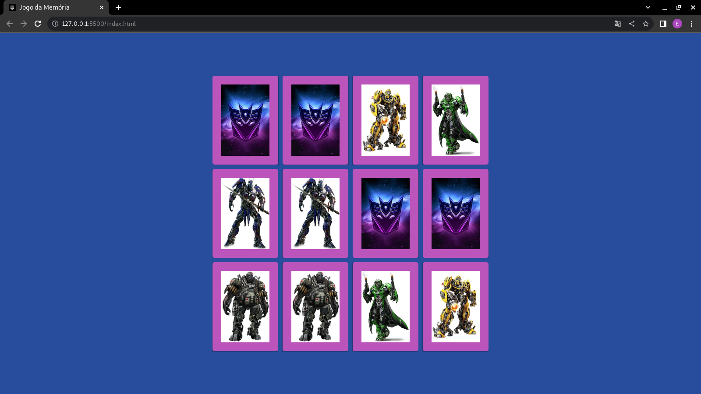

# Jogo_da_Memoria
    - Jogo da memória com Efeitos 3D
    - Projeto da Digital Innovation One
#
## Tela Inicial
#

#

### Criando o Jogo
    - 04/11/2021
    - Início ás 19h45m
    - Aulas Finalizadas

### Implementações no Projeto
    - Imagens do jogo Baseado no Filme
    - Transformers - A Era da Extinção
    - Imagens do Pinterest
    - Layout Alterado 
    - Finalizando o game 22h55m
    - Entregando o Projeto ás 23h

#

&copy; Copyright 2022 Erimilson Silva

  

#